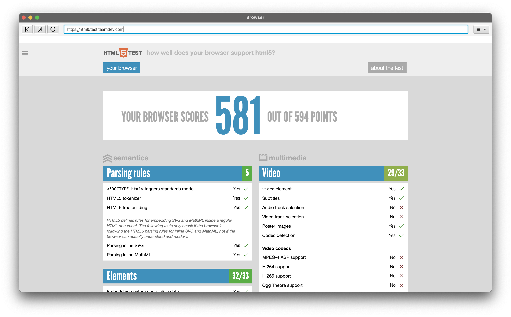

# JavaFX JX-Browser Demo App

A lightweight desktop browser application built with JavaFX, Java 17 (Liberica FX), and Gradle. This app provides essential browsing functionality, such as navigating to websites, reloading pages, and moving backward and forward through your browsing history. Additionally, it supports access to the camera and microphone, making it suitable for modern web applications that require multimedia input.

---

## Features

* **URL Navigation**: Load web content by entering a URL in the address bar.
* **Back and Forward Navigation**: Seamlessly navigate through browsing history.
* **Reload**: Refresh the current page with a single click.
* **Camera and Microphone Support**: Enables multimedia web applications, such as video conferencing or online recording tools.
* **Cross-Platform Compatibility**: Runs on Windows, macOS, and Linux desktops.

## Technologies Used

* **JavaFX**: Provides a modern and flexible UI framework for building desktop applications.
* **Liberica FX**: A JDK distribution that bundles JavaFX for easy deployment.
* **Gradle**: A powerful build automation tool for compiling, packaging, and managing dependencies.
* **WebView**: The core component used for rendering web content.

## Prerequisites
* **Java 17**: Ensure you have the Liberica JDK 17 installed (or any JDK with JavaFX support).
* **Gradle**: Required for building and running the project.

## Getting Started

### Clone the Repository

```bash
git clone https://github.com/mrdafian47/javafx-jxbrowser-demo-app
cd javafx-jxbrowser-demo-app
```

### Build and Run the App

1. Build the project:
```bash
./gradlew build
```

2. Run the project:
```bash
./gradlew run
```

## Usage

1. Enter a URL in the address bar (e.g., https://example.com) and press Enter to load the page.
2. Use the Back and Forward buttons to navigate through your browsing history.
3. Click the Reload button to refresh the current page.
4. Grant camera and microphone permissions if prompted by the web application.

## Screenshots

Example  screenshots to showcase the UI.

<p align="center">
  
</p>

## License
This project is licensed under the MIT License.